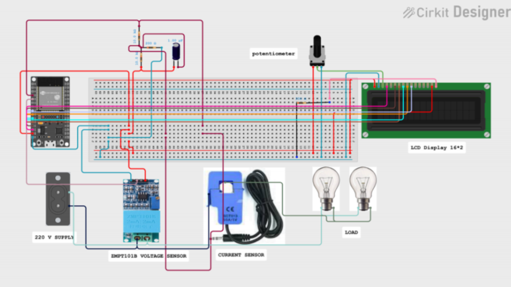

# Smart-Energy-Meter
The Smart Energy Meter project monitors and analyzes real-time power consumption using voltage and current sensors. It displays live readings on an LCD and transmits data to the Blynk IoT cloud for remote monitoring. Collected data is processed in Python to identify usage trends, and a machine learning model is trained to predict future energy consumption, enabling smarter and more efficient energy management.

# Tech Stack Used 
Microcontroller & Programming: ESP32, Arduino IDE (Embedded C)
Sensors & Components: SCT-013 (Current Sensor), ZMPT101B (Voltage Sensor), LM7805 (Voltage Regulator), 16×2 LCD Display
IoT Platform: Blynk Cloud (Real-time Data Monitoring)
Data Analysis & Modeling: Python, Pandas, Matplotlib, Scikit-learn
Machine Learning: Linear Regression Model for Energy Consumption Prediction

# Circuit Diagram:

